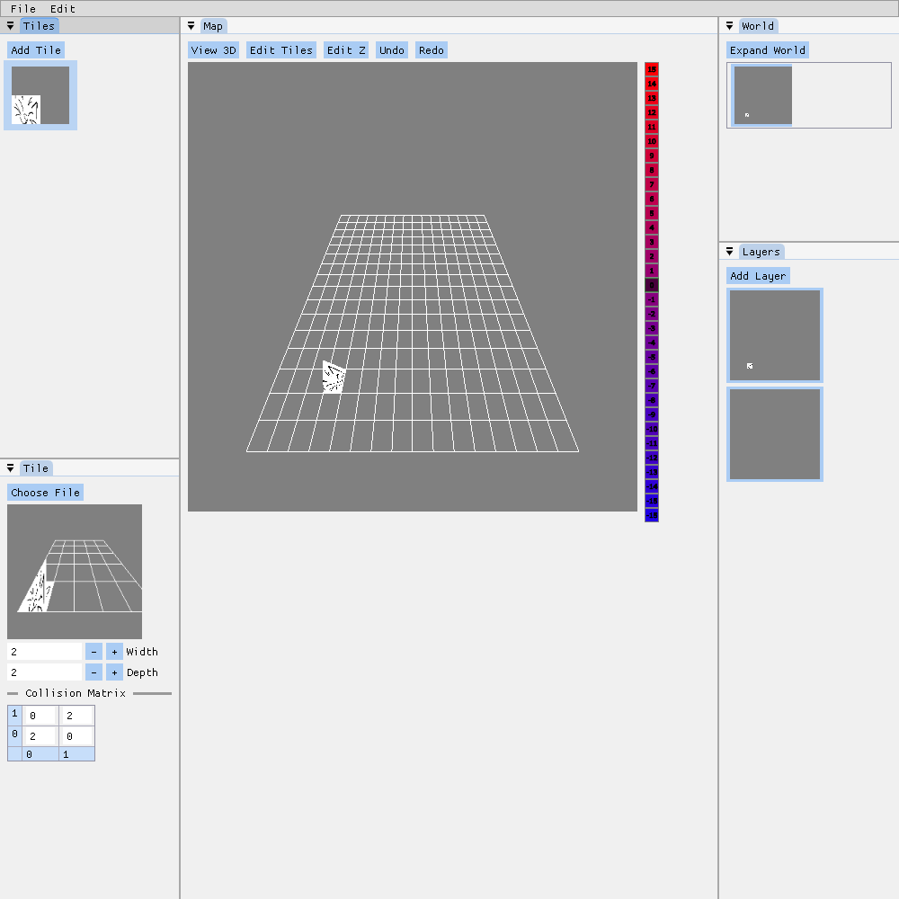

# Map Editor



Map Editor is a tool for creating 2.5D maps in the style of Pokemon Gen IV and
V. However, it does not use any data structures or file formats from the
Pokemon games.

Features:

- Importing 3D models as tiles
- Exporting maps as 3D models
- Saving and loading map files
- Defining tiles that span multiple squares

To build:

```
$ mkdir build
$ cd build
$ cmake ../
$ make
```

Third-party dependencies:

- Assimp
- Google Dawn
- Dear ImGui
- glm
- nlohmann::json
- stb_image

All dependencies should be automatically downloaded by CMake.

Prior art:

- [Pokemon DS Map Studio](https://github.com/Trifindo/Pokemon-DS-Map-Studio)
- [Elit3D](https://github.com/christt105/Elit3D)
